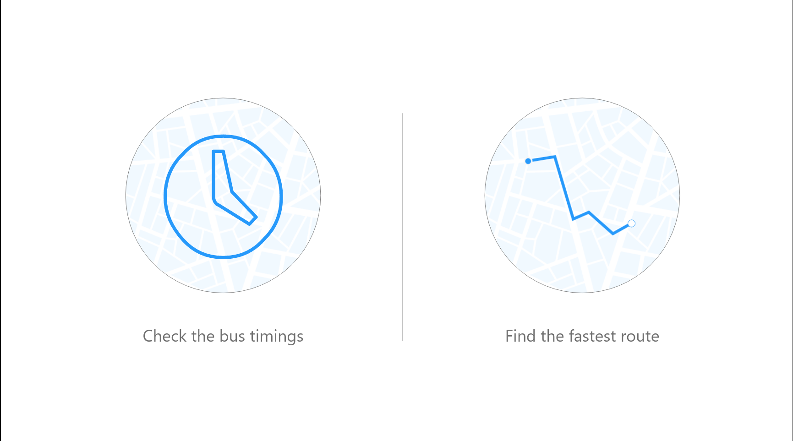
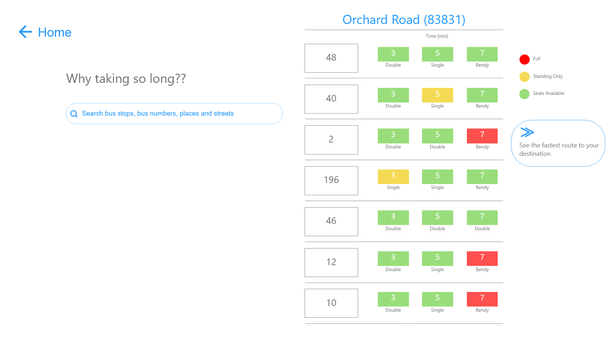

#  Bus App 2.0

I live in the eastern side of the island and have to travel all the way across to get to school. In order to reach school on time, I frequently use mobile apps to check the arrival times of buses and use this information to calculate the fastest route to take. Wouldn't it be simpler if we could let the computer do that for us? This application that I am developing would display the arrival times of buses as well as help the user calculate the fastest route to his/her destination. 

This app aims to make travelling even more convenient and allow users to make more educated decisions on what buses to take to get where they need to be by using real time data from APIs.
 
## Design Process
 
I would be using 2 APIs for this application - LTA DataMall's Bus Arrival API for bus arrival timings and gothere.sg's Map API for calculating the fastest route to the destination.

User Stories:
As a user, I would like to check the bus arrival times to know when I should leave the house / calculate my ETA.
As a user, I would like to know the fastest route to my destination. With multiple bus routes across the island, I may have different ways to get to the same place. Hence, I would like to know which way is fastest.
As a user, I would like to see how crowded the buses are before they arrive so that I know whether I should get on or wait for another bus.
As a user, I would like to know if the next bus arriving is wheelchair accessible so that I would know if I/my wheelchair-bound loved one can board.

Wireframe:
- https://xd.adobe.com/view/9e498eaa-1905-4dd3-bcac-5bfce634d633-cb1a/
- Used wireframe kits to design wireframe (link: https://www.behance.net/gallery/55462459/Wires-wireframe-kits-for-Adobe-XD)
- Home Page:

- Bus Timings:

- Fastest Route:

- Map:

API links: 
- LTA DataMall : https://www.mytransport.sg/content/mytransport/home/dataMall.html
- gothere.sg : https://gothere.sg/api/maps/overview.html

## Features
 
### Existing Features
- Bus Arrival timings : Allows users to check the arrival times of the next 3 buses at a particular stop
- Bus information : Allows users to see if the next buses are wheelchair accesible and how crowded they are
- Fastest route : Allows users to find the fastest route to their destination via bus/train
- Dynamic Breadcrumb : Have a breadcrumb nav at the top of the page that chagnes based in the pages the user navigates from

## Technologies Used

- [JQuery](https://jquery.com)
    - The project uses **JQuery** to simplify DOM manipulation.

- [Bootstrap](https://getbootstrap.com/)
    - This project uses **Bootstrap** to design CSS properties.

- [LTA DataMall](https://www.mytransport.sg/content/mytransport/home/dataMall.html)
    - This project uses **LTA DataMall** APIs to display bus arrival times and information

- [gothere.sg](https://gothere.sg/api/maps/overview.html)
    - This project uses **gothere.sg**'s API to calculate and display the fastest route to one's destination via public transport

- [AdobeXD](https://www.adobe.com/sea/products/xd.html)
    - This project used **AdobeXD** to build the wireframe prototype of the final application
    - Also used to export images as svg to final application.
    - Used [wireframe kits](https://www.behance.net/gallery/55462459/Wires-wireframe-kits-for-Adobe-XD) to design wireframe

- [Chrome](https://www.google.com/intl/en_sg/chrome/)
    - This project was tested **using Google Chrome**

- [Edge](https://www.microsoft.com/en-us/edge)
    - It was also tested using **Microsoft Edge** 

## Testing

1. gothere.sg API:
    1.1 Problem: When script is embeded into html document, an error occurs. ("A parser-blocking, cross site (i.e. different eTLD+1) script, <URL>, is invoked via document.write. The network request for this script MAY be blocked by the browser in this or a future page load due to poor network connectivity. If blocked in this page load, it will be confirmed in a subsequent console message. See <URL> for more details.")
    1.1.1 Solution: This error only applies to networks with poor connectivity (2G netowrks and below). Since Singaporeans mostly use 3G or 4G, this should only a affect a small group of people.

2. LTA DataMall API:
    2.1 Problem: I added a button with type = "submit". On click, the JS code would run for a split second before resetting to what it was before the click as submit buttons clear the form after submission. 
    2.1.1 Solution: Change the button type to generic "button" so that it would not revert back to its state before the submission.    

    2.2 Problem: When adding https://cors-anywhere.herokuapp.com/ to the endpoint, an error 400 occurs with the message "Header required". 
    Troubleshooting: 
    2.2.1 Test endpoint on postman, get error message: "Missing required request header. Must specify one of: origin,x-requested-with". According to this [forum](https://stackoverflow.com/questions/59272380/how-to-fix-the-missing-required-request-header-must-specify-one-of-origin-x-r) some sites block CORS. However, when CORS endpoint is removed, I get 400 bad request.
    2.2.2 Solution: Added header "X-Requested-With": "XMLHttpRequest" and created seperate settings variable instead of putting it within $.ajax{} call. Removed unecessary headers.

    2.3 Problem: The Bus Stops API only displays the first 500 records per request (To display more, use the $skip operator). Hence, given a particular bus stop code, I decided to loop through each group of 500 records until I found the corresponding bus stop. However, when I ran my code, this error appeared: SBOX_FATAL_MEMORY_EXCEEDED. This happens when the memoy consumption within the browser is so big that the tab crashes :(
    2.3.1 Solution (Temporary): Use Postman and manually cycle through each record of 500 and find the code of the last bus stop within that response. Store these codes in a list boundary. Loop through each item in boundary. If the given code is <= boundary[i], $skip= i*500 to skip to the correct group of 500 records. However, this solution may not always work as the API may be changed as new bus stops are added.

3. Apperance
    My project looks the same across all browsers except for Internet Explorer, which does not support some CSS properties such as flexboxes and breadcrumbs.
    It works well with different screen sizes and re-arranges HTML elements nicely.

## Credits
Code References:
 - [JQuery Docs](https://api.jquery.com/)
 - [Bootstrap](https://getbootstrap.com/docs/5.0/getting-started/introduction/)
 - For HTML, CSS and vanilla JS: 
- [Wireframe Kits](https://www.behance.net/gallery/55462459/Wires-wireframe-kits-for-Adobe-XD)

API Documentation:
- [gothere.sg](https://gothere.sg/api/maps/overview.html)
- [LTA DataMall](https://www.mytransport.sg/content/dam/datamall/datasets/LTA_DataMall_API_User_Guide.pdf)

Images:
 - [Wheelchair](https://www.flaticon.com/free-icon/wheelchair_25332?term=wheelchair&page=1&position=2) - Resized in AdobeXD and then exported as SVG
 - All others from [UI kits](https://www.behance.net/gallery/55462459/Wires-wireframe-kits-for-Adobe-XD) exported as SVG
